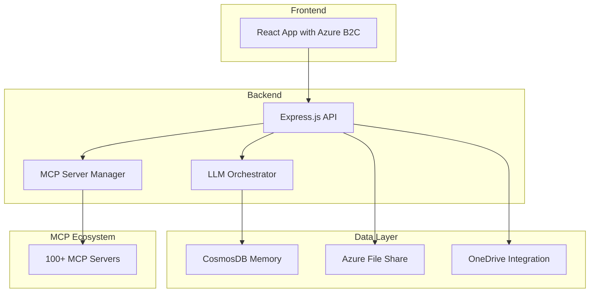

# AIMCS - AI Multimodal Customer System

A comprehensive AI system featuring React frontend, Azure B2C authentication, CosmosDB memory storage, and integration with 100+ Model Context Protocol (MCP) servers.

**Created by the Zimax Networks AI Architecture and Engineering Team**

## Repository Structure

This project is organized as a monorepo using Git submodules:

```
aimcs/
├── aimcs-frontend/        # React 18 + Vite frontend application
├── aimcs-backend/         # Node.js 20 API backend
├── aimcs-infrastructure/  # Azure ARM/Bicep infrastructure templates
└── README.md             # This file
```

## Quick Start

### Clone the Repository

```bash
# Clone the main repository with submodules
git clone --recursive https://github.com/zimaxnet/aimcs.git
cd aimcs

# Or if you already cloned without --recursive
git submodule update --init --recursive
```

### Working with Submodules

```bash
# Update all submodules to their latest commits
git submodule update --remote

# Work on a specific submodule
cd aimcs-frontend
# Make changes, commit, and push as usual

# Update the main repository to point to new submodule commits
cd ..
git add aimcs-frontend
git commit -m "Update frontend submodule"
git push
```

## Individual Components

### Frontend (`aimcs-frontend/`)
- **Technology**: React 18, Vite, Tailwind CSS
- **Features**: Professional homepage, AI model testing, voice chat
- **Deployment**: Azure Web Apps (aimcs.net)
- **Status**: ✅ Live and deployed

### Backend (`aimcs-backend/`)
- **Technology**: Node.js 20, Express.js
- **Features**: API endpoints, authentication, AI integration
- **Deployment**: Azure Container Apps
- **Status**: 🚧 In development

### Infrastructure (`aimcs-infrastructure/`)
- **Technology**: ARM/Bicep templates
- **Features**: Azure resource definitions, CI/CD pipelines
- **Deployment**: Azure Resource Manager
- **Status**: 🚧 In development

## Architecture



## Features

- 🔐 **Azure B2C Authentication** - Secure user management
- 🧠 **Multi-LLM Orchestration** - Sequential thinking with OpenAI + Anthropic
- 💾 **Persistent Memory** - CosmosDB-backed conversation history
- 🛠 **100+ MCP Servers** - Extensive tool ecosystem integration
- 📁 **File Processing** - OneDrive, Azure File Share, multimodal support
- 🔍 **Web Search** - Brave Search integration
- 🔗 **Service Integration** - GitHub, Slack, Gmail, Notion, and more

## Development Workflow

1. **Frontend Development**: Work in `aimcs-frontend/` directory
2. **Backend Development**: Work in `aimcs-backend/` directory  
3. **Infrastructure Changes**: Work in `aimcs-infrastructure/` directory
4. **Cross-component Changes**: Update submodule references in the root repository

## Deployment

Each component has its own deployment pipeline:

- **Frontend**: GitHub Actions → Azure Web Apps
- **Backend**: GitHub Actions → Azure Container Apps
- **Infrastructure**: GitHub Actions → Azure Resource Manager

## Contributing

1. Fork the repository
2. Create a feature branch in the appropriate submodule
3. Make your changes
4. Test thoroughly
5. Submit a pull request

## License

© 2024 Zimax Networks. All rights reserved.

## Support

For support and questions, please contact the Zimax Networks AI Architecture and Engineering Team.
